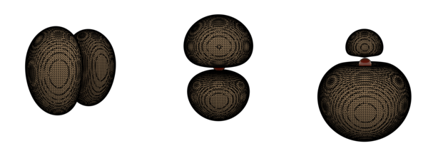

# Den2Obj

Converts VASP density files (i.e. CHGCAR / PARCHG) to a [Wavefront .obj file](https://en.wikipedia.org/wiki/Wavefront_.obj_file).

## Example images


## Compilation instructions

Den2Obj has the following dependencies:
* Boost
* GLM
* TCLAP

To compile, run the following commands:
```
git clone https://github.com/ifilot/den2obj.git
cd den2obj
mkdir build
cd build
cmake ../src
make -j5
```

## Usage

```
<path to>/den2obj -i CHGCAR -o <filename.obj> -v <isovalue>
```

Example:
```
./den2obj -i CHGCAR -o orbital.obj -v 0.1
```

Example output:
```
--------------------------------------------------------------
Executing DEN2OBJ v.0.2.0
Author: Ivo Filot <i.a.w.filot@tue.nl>
--------------------------------------------------------------
Using isovalue: 0.1
Identified 1608 faces.
Writing to orbital.obj
--------------------------------------------------------------
Done in 0.0177371 seconds.
```
