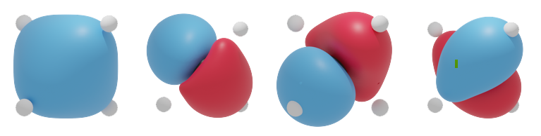

# Den2Obj


[](https://github.com/ifilot/den2obj/actions/workflows/build.yml)
[](https://github.com/ifilot/den2obj/actions/workflows/build-openvdb.yml)
[](https://codecov.io/gh/ifilot/den2obj)
[](https://ifilot.github.io/den2obj/)
[](https://www.gnu.org/licenses/gpl-3.0)

## Purpose
Den2Obj is a command-line tool that construct isosurfaces from densely packed
scalar fields. Den2Obj supports VASP charge files such as CHGCAR and PARCHG,
Gaussian .cube files as well as its own .d2o format.

## Example images


## Compilation instructions

### Debian Latest

Getting the dependencies

```bash
sudo apt install build-essential cmake libtclap-dev libboost-all-dev libopenvdb-dev libtbb-dev \
pkg-config libcppunit-dev libeigen3-dev liblzma-dev zlib1g-dev libbz2-dev libssl-dev
```

To compile, run the following commands:

```bash
git clone https://github.com/ifilot/den2obj.git
cd den2obj
mkdir build
cd build
cmake -DMOD_OPENVDB=1 ../src
make -j5
```

### Ubuntu Latest

The stable OpenVDB library (`libopenvdb`) under Ubuntu is incompatible with the 
Threading Building Blocks (`libtbb`) library. To solve this, manually compile 
and install OpenVDB 8.2 using the following instructions.

Getting the dependencies

```bash
sudo apt install build-essential cmake libtclap-dev libboost-all-dev libopenvdb-dev libtbb-dev \
pkg-config libcppunit-dev libeigen3-dev liblzma-dev zlib1g-dev libbz2-dev libssl-dev
```

Next download and install OpenVDB.

```bash
get https://github.com/AcademySoftwareFoundation/openvdb/archive/refs/tags/v8.2.0.tar.gz
tar -xvzf v8.2.0.tar.gz
mkdir openvdb-build && cd openvdb-build && cmake ../openvdb-8.2.0 -DCMAKE_INSTALL_PREFIX=/opt/openvdb
make -j9 && sudo make install
```

Thereafter, clone, configure and compile Den2Obj and link against OpenVDB 8.2.

```bash
git clone https://github.com/ifilot/den2obj.git
cd den2obj
mkdir build
cd build
cmake -DMOD_OPENVDB=1 ../src
make -j5
```

## Usage

### Isosurfaces

```
<path to>/den2obj -i CHGCAR -o <filename.obj> -v <isovalue>
```

Example:
```
./den2obj -i CHGCAR -o orbital.obj -v 0.1
```

## Options

* `-c`: Center the structure, i.e. the center of the structure is placed at the origin of the coordinate system.
* `-t`: Converts one file format to another. File formats are auto-recognized based on the extensions.

### Conversions

Converting CHGCAR to OpenVDB
```
./den2obj -i CHGCAR_xxx -o xxx.vdb -t
```

Converting CHGCAR to D2O
```
./den2obj -i CHGCAR_xxx -o xxx.d2o -t
```

**Supported input types:**
* CHGCAR
* PARCHG
* LOCPOT
* Gaussian cube (.cub)
* D2O files (.d2o)

**Supported dense output types:**
* D2O
* OpenVDB

**Supported isosurface object types:**
* [Stanford .ply file](https://en.wikipedia.org/wiki/PLY_(file_format))
* [Wavefront .obj file](https://en.wikipedia.org/wiki/Wavefront_.obj_file)

## D2O file format

The D2O file format is native to `Den2Obj`. This file format stores the scalarfield
in binary format and uses compression to generate small files which are fast to
read from. More information on the file format can be found in the
[documentation](https://ifilot.github.io/den2obj/).

## Shared library

`Den2Obj` can also be used as a shared library in your own code. See the
[examples/shared](examples/shared) for an example.