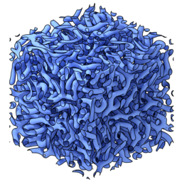

# Den2Obj

## Purpose
Converts VASP density files (i.e. CHGCAR / PARCHG) or a Gaussian cube file to a [Wavefront .obj file](https://en.wikipedia.org/wiki/Wavefront_.obj_file), [Stanford .ply file](https://en.wikipedia.org/wiki/PLY_(file_format)) or [OpenVDB format](https://www.openvdb.org/).

## Example image


*The isosurface above represents the concentration profile of a reaction-diffusion system in 3D using Gray-Scott kinetics. The isosurface has been generated using den2obj and rendered using [Blender](https://www.blender.org/).*

## Compilation instructions

Getting the dependencies
```
sudo apt install build-essential cmake libglm-dev libtclap-dev libboost-all-dev libopenvdb-dev libtbb-dev
```

To compile, run the following commands:
```
git clone https://github.com/ifilot/den2obj.git
cd den2obj
mkdir build
cd build
cmake ../src
make -j5
```

## Usage

```
<path to>/den2obj -i CHGCAR -o <filename.obj> -v <isovalue>
```

Example:
```
./den2obj -i CHGCAR -o orbital.obj -v 0.1
```

Example output:
```
--------------------------------------------------------------
Executing DEN2OBJ v.0.4.0
Author: Ivo Filot <i.a.w.filot@tue.nl>
Website: https://github.com/ifilot/den2obj
--------------------------------------------------------------
Using isovalue: 0.1
Identified 1608 faces.
Writing to orbital.obj
--------------------------------------------------------------
Done in 0.0177371 seconds.
```

## Options

* `-c`: Center the structure, i.e. the center of the structure is placed at the origin of the coordinate system.
* `-p`: Write output as a binary `.ply` file rather than `.obj` file. The program automatically detects the [endianness](https://en.wikipedia.org/wiki/Endianness) of your system.
* `-d`: Write output as an OpenVDB file. This directive overrules the `p` directive.
* `-b`: Read from cube source rather than `CHGCAR` or `PARCHG` file (read about the format of this [binary file](#binary-source) below!).
