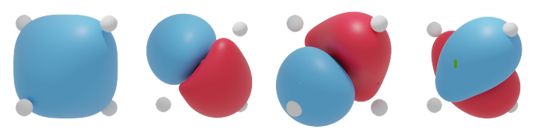

# Den2Obj


[](https://github.com/ifilot/den2obj/actions/workflows/build.yml)
[](https://github.com/ifilot/den2obj/actions/workflows/build-openvdb.yml)
[](https://codecov.io/gh/ifilot/den2obj)
[](https://ifilot.github.io/den2obj/)
[](https://www.gnu.org/licenses/gpl-3.0)

## Purpose

Den2Obj is a command-line tool for computational chemists and materials
scientists who want to visualize volumetric scalar fields from ab initio
calculations as 3D isosurface meshes.

It reads scalar field data produced by [VASP](https://www.vasp.at/) (CHGCAR,
PARCHG, LOCPOT) and [Gaussian](https://gaussian.com/) (`.cub`) and extracts
isosurfaces using the marching cubes or marching tetrahedra algorithm. The
resulting surfaces — representing quantities such as electron density, partial
charge density, or electrostatic potential — are written to standard 3D mesh
formats (`.obj`, `.ply`, `.stl`) that can be directly imported into tools like
Blender or MeshLab for high-quality rendering.

Den2Obj also supports format conversion: VASP and Gaussian files can be
converted to the native `.d2o` compressed binary format or to OpenVDB (`.vdb`)
for volumetric rendering workflows. When writing `.d2o`, Den2Obj benchmarks all
supported compression algorithms (gzip, lzma, bzip2, zstd, blosc) and
automatically selects the one that produces the smallest file, so no manual
tuning is needed.

## Example images



## Quick start

No VASP or Gaussian files needed. Den2Obj ships with built-in datasets so you
can try it immediately after compiling:

```bash
# Generate a built-in scalar field and extract an isosurface from it
./den2obj -g genus2 -o genus2.d2o
./den2obj -i genus2.d2o -o genus2.obj -v 0.5
```

The first command writes the `genus2` dataset to a `.d2o` file. The second
extracts an isosurface at isovalue 0.5 and writes a Wavefront `.obj` mesh that
can be opened directly in Blender or MeshLab. See
[Built-in datasets](#built-in-dataset-generation) for the full list.

## Compilation instructions

### Debian-based systems (Ubuntu, Debian)

Tested on Ubuntu 24.04 LTS (Noble) and Debian 12 (Bookworm). Install the
dependencies:

```bash
sudo apt install build-essential cmake libtclap-dev libboost-all-dev \
libopenvdb-dev libtbb-dev pkg-config libcppunit-dev libeigen3-dev liblzma-dev \
zlib1g-dev libbz2-dev libzstd-dev libblosc-dev libssl-dev
```

Compile:

```bash
git clone https://github.com/ifilot/den2obj.git
cd den2obj
mkdir build && cd build
cmake -DMOD_OPENVDB=1 ../src
make -j5
```


## Usage

### Isosurfaces

Reads a scalar field from `<input file>` and extracts a surface at the given
isovalue, writing a 3D mesh to `<output file>`. The output format (`.obj`,
`.ply`, or `.stl`) is determined by the file extension.

```bash
den2obj -i <input file> -o <output file> -v <isovalue>
```

Example — extract an isosurface at density 0.1 from a VASP charge file:

```bash
./den2obj -i CHGCAR -o orbital.obj -v 0.1
```

> **Choosing an isovalue:** Den2Obj prints the minimum and maximum value of the
> scalar field on startup. Use these as a guide to pick a meaningful isovalue
> for your data.

### Centering the structure

By default the mesh is placed in the coordinate system of the original unit
cell. Use `-c` to shift the structure so its center lies at the origin, which
is convenient when importing into rendering software:

```bash
./den2obj -i CHGCAR -o orbital.obj -v 0.1 -c
```

### Dual isosurfaces (positive and negative lobes)

Useful for visualizing molecular orbitals, which have both a positive and a
negative lobe. The `-d` flag runs the extraction twice — once at `+isovalue`
and once at `-isovalue` — and writes the results to two separate files with
`_pos` and `_neg` suffixes:

```bash
./den2obj -i CHGCAR -o orbital.obj -v 0.1 -d
# produces orbital_pos.obj and orbital_neg.obj
```

### Isosurface algorithm

Use `-a` to select the triangulation algorithm. `marching-cubes` (default) is
faster; `marching-tetrahedra` subdivides each cube into tetrahedra and can
produce smoother surfaces at the cost of more triangles:

```bash
./den2obj -i CHGCAR -o orbital.obj -v 0.1 -a marching-cubes
./den2obj -i CHGCAR -o orbital.obj -v 0.1 -a marching-tetrahedra
```

### Conversions

Use `-t` to convert between file formats without generating an isosurface.
The output format is inferred from the output file extension.

Converting CHGCAR to D2O:

```bash
./den2obj -i CHGCAR_xxx -o xxx.d2o -t
```

Converting CHGCAR to OpenVDB (requires OpenVDB build):

```bash
./den2obj -i CHGCAR_xxx -o xxx.vdb -t
```

Specifying a compression algorithm for D2O output:

```bash
./den2obj -i CHGCAR_xxx -o xxx.d2o -t -a lzma
```

Available compression algorithms: `auto` (default), `gzip`, `lzma`, `bzip2`,
`zstd`, `blosc`.

### Built-in dataset generation

Den2Obj can generate built-in scalar field datasets without any external input
files, useful for testing and demonstrations. Use `-g` to select the dataset;
the output is always a `.d2o` file:

```bash
./den2obj -g genus2 -o genus2.d2o
./den2obj -g benzene_homo -o benzene_homo.d2o
./den2obj -g benzene_lumo -o benzene_lumo.d2o
```

| Dataset | Description |
|---------|-------------|
| `genus2` | Mathematical genus-2 surface |
| `benzene_homo` | HOMO of benzene (STO-3G) |
| `benzene_lumo` | LUMO of benzene (STO-3G) |

## Options reference

| Flag | Long form | Description |
|------|-----------|-------------|
| `-i` | `--input` | Input file (e.g. `CHGCAR`, `file.cub`, `file.d2o`) |
| `-o` | `--filename` | Output file |
| `-v` | `--isovalue` | Isovalue for isosurface generation |
| `-c` | `--center` | Center the structure at the origin |
| `-d` | `--dual` | Produce both positive and negative isosurfaces |
| `-t` | `--transform` | Convert input file to a different format (no isosurface) |
| `-a` | `--algo` | Algorithm for isosurface (`marching-cubes`, `marching-tetrahedra`) or compression for D2O (`auto`, `gzip`, `lzma`, `bzip2`, `zstd`, `blosc`) |
| `-g` | `--dataset` | Generate a built-in test dataset |

**Supported input types:**
* CHGCAR
* PARCHG
* LOCPOT
* Gaussian cube (`.cub`)
* D2O files (`.d2o`)

**Supported dense output types:**
* D2O
* OpenVDB

**Supported isosurface output types:**
* [Stanford .ply file](https://en.wikipedia.org/wiki/PLY_(file_format))
* [Stereolithography .stl file](https://en.wikipedia.org/wiki/STL_(file_format))
* [Wavefront .obj file](https://en.wikipedia.org/wiki/Wavefront_.obj_file)

## D2O file format

The D2O file format is native to Den2Obj. It stores the scalar field in binary
format with compression, producing small files that load quickly. More
information can be found in the
[documentation](https://ifilot.github.io/den2obj/).

## Shared library

Den2Obj can also be used as a shared library in your own code. See
[examples/shared](examples/shared) for a usage example.

## Running tests

To build and run the unit tests:

```bash
git clone https://github.com/ifilot/den2obj.git
cd den2obj
mkdir build && cd build
cmake ../src
make -j5
./src/test/unittest
```

## License

Den2Obj is distributed under the [GNU General Public License v3](LICENSE).
