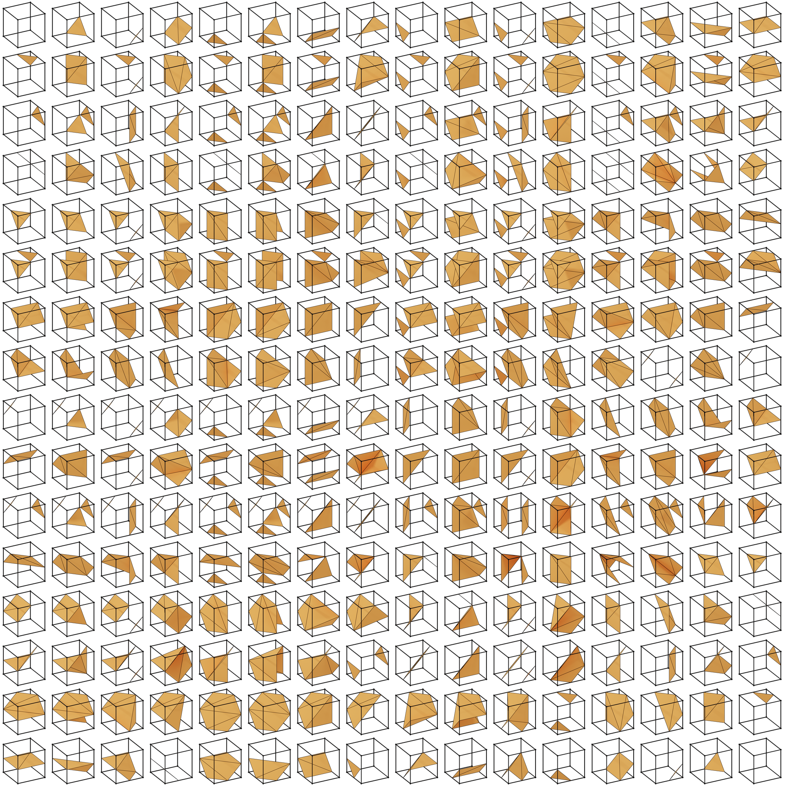

.. _background:
.. index:: Background

Background
**********

Below, a brief explanation on isosurface construction is given. A more technical
description can be found on the `excellent website of Paul Bourke <http://paulbourke.net/geometry/polygonise/>`_.

Isosurfaces are built by picking a single representative value termed the
isovalue and finding all points in the domain under consideration which have
this value. These points are stitched together to construct a three-dimensional
surface.

The construction of isosurfaces, i.e. the set of points that (by approximation)
are all associated to the same value of a function, is done using an algorithm
called the `marching cubes algorithm
<https://en.wikipedia.org/wiki/Marching_cubes>`_. In this algorithm, the first
step is to define a grid consisting of a set of points on which the function
under inspection is being probed. This grid is typically an equidistant grid in
three dimensions.

The grid naturally divides the space wherein the function is evaluated into a
series of cells wherein each cell contains 8 vertices. For each of the 8
vertices in each cell, it is determined whether the value of the function is
larger or smaller than the isovalue. If for one vertex the value is larger than
the isovalue and for another vertex the value smaller than the isovalue, then
the isosurface has to cut the edge that shares the two vertices. A schematic
depiction of this situation is given in Figure 1.

.. figure:: _static/img/background/cube_intersection.jpg
   :alt: Schematic depiction of cube intersections.

   **Figure 1**: A triangle that is part of an isosurface. For each of the vertices
   on triangle, the point corresponds to the isovalue. These points lie on
   the edges 1, 4, and 5 (green numbers) and are found by probing whether the
   values at the cube vertices 1-2, 1-4, and 1-5, lie on opposite sides of the
   isovalue.

Given eight vertices per cube, there are only :math:`2^{8}=256` possibilities of
how a scalar field can interact with each cube. These possibilities are shown
in Figure 2. Note that within this set of 256 possibilities, there are only 15
unique results as the majority of the results are linked by a symmetry
operation such as a rotation. All these 256 different ways by which the scalar
field can interact with each cell are stored in a pre-calculated table by which
the resulting list of edge intersections and the polygons that originate from
these intersections can be readily found. The exact position where the
isosurface intersects each edge is determined using trilinear interpolation.

   **Figure 2**: The 256 possible ways that a scalar field can interact with
   each cube.

To repeat on this. First the space wherein the function is evaluated is
discretized into small cubes. Next, for each vertex on these cubes the function
is evaluated and it is determined whether the value for the function at each of
the vertices is larger or smaller than the isovalue. This leads to a number of
edge intersections for each cube from which the polygons (triangles) for each
cube can be established. As a final step, all polygons are gathered to form the
threedimensional isosurface. It should be noted that this algorithm can be
executed in a highly efficient fashion using trivial parallellization as the
result for each cube is completely independent from all the other cubes. It
turns out that the generation of the scalar field, which by itself is also a
highly parallellizable step, is typically the most time-consuming.

The quality of the isosurface depends on the resolution of the grid used to
sample the scalar field. The finer the grid (or mesh) used, the better the
quality of the isosurface. Of course, a finer mesh comes at the expense of more
values that need to evaluated in the algorithm.
