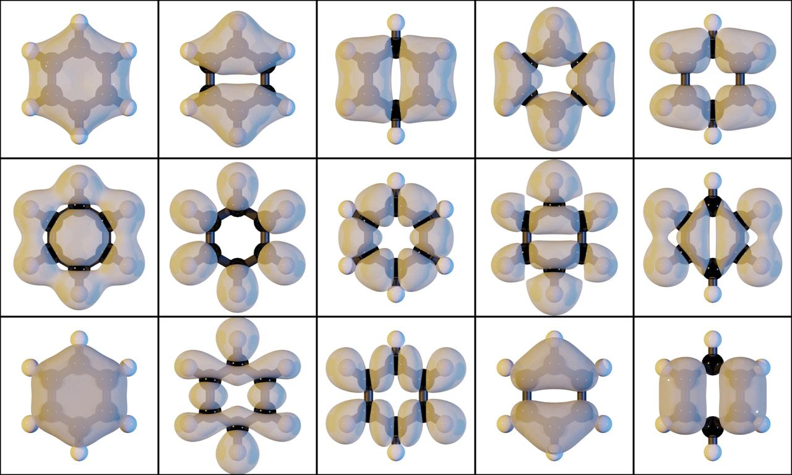

.. _examples:
.. index:: Examples

Examples
********

Charge distribution
-------------------

   **Figure 1**: Isosurfaces with an isovalue of 0.01 for the occupied molecular orbitals
   of benzene, as calculated with the `VASP <https://www.vasp.at/>`_ program.
