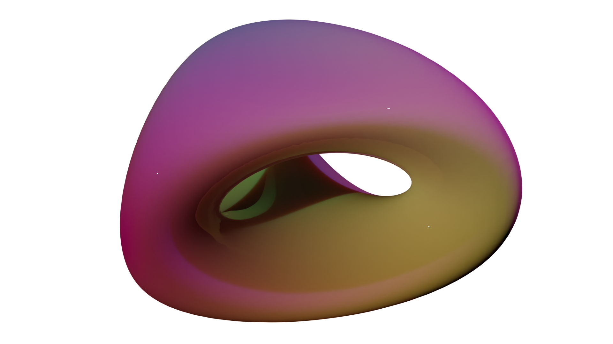
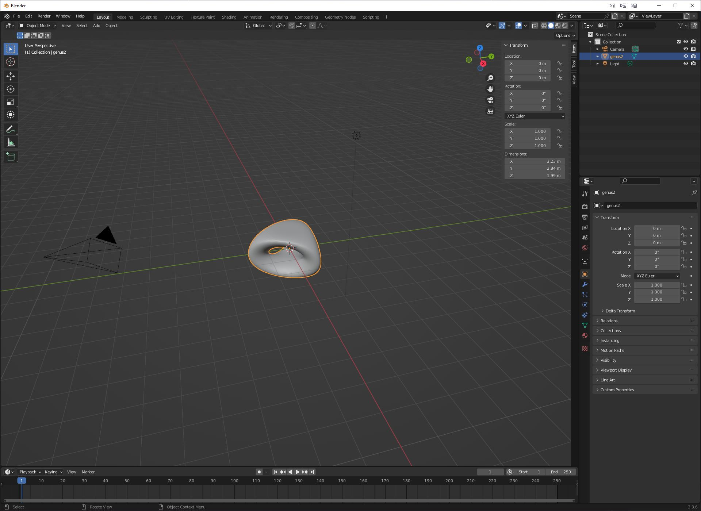
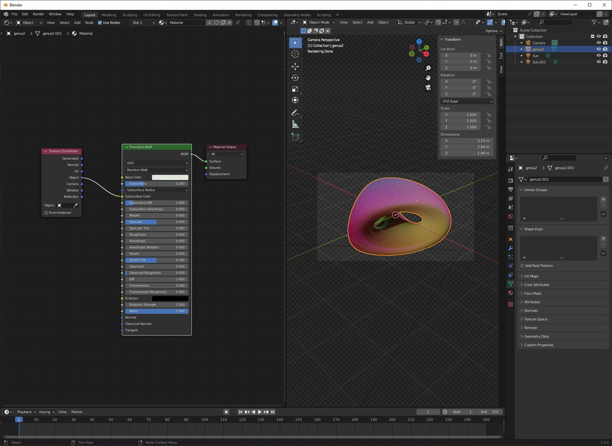

.. _tutorial:
.. index:: Tutorial

Tutorials
=========

.. contents::
   :local:

This tutorial describes in a step-by-step procedure how to use :program:`Den2Obj`.
:program:`Den2Obj` comes bundled with a generator to produce scalar fields. As
such, no additional calculations on your side are required to follow this
tutorial.

.. note::
    * To follow along with this tutorial, ensure you have compiled
      :program:`Den2Obj` and tested that it is working. See the
      :ref:`installation section<Installation>` for more information.
    * For the visualization of the isosurfaces, we will be making use of
      Blender. To follow along, please make sure you use
      `Blender 3.3 LTS <https://www.blender.org/download/lts/3-3/>`_.
    * We will not explain how to set materials to objects or how to perform
      image rendering in Blender. If you are unfamiliar with Blender and wish
      to learn upon these matters, we can warmly recommend the
      `tutorials by Blender Guru <https://www.youtube.com/watch?v=nIoXOplUvAw>`_.

Genus2 dataset
--------------

In this tutorial, we will be reproducing the Figure as shown below.

First, we need to build the scalar field. To produce the Genus 2 scalar field,
run the following::

    ./den2obj -g genus2 -o genus2.d2o

You should see the following output::

    --------------------------------------------------------------
    Executing DEN2OBJ v.1.1.0
    Author:  Ivo Filot <i.a.w.filot@tue.nl>
    Website: https://den2obj.imc-tue.nl
    Github:  https://github.com/ifilot/den2obj
    --------------------------------------------------------------
    Building grid using dataset: genus2
    Looking for best compression algorithm.
    Trying GZIP: 2720.5 kb (69.64 %).
    Trying LZMA: 1781.2 kb (45.60 %).
    Trying BZIP2: 3149.8 kb (80.63 %).
    Floating point size determined at: 4 bytes
    Writing genus2.d2o (1781.3kb).
    -------------------------------------------------------------------------------
    Done in 1.42421 seconds.

This will generate a :ref:`.d2o file <D2O file format>` containing the Genus 2
scalar field named ``genus2.d2o``. Observe that :program:`Den2Obj` tests three
different compression algorithms and automatically selects the best algorithm
for the data compression.

To construct the isosurface with an isovalue of 0.1, run::

    ./den2obj -i genus2.d2o -o genus2.ply -v 0.1 -c

Which will give the following output::

    --------------------------------------------------------------
    Executing DEN2OBJ v.1.1.0
    Author:  Ivo Filot <i.a.w.filot@tue.nl>
    Website: https://den2obj.imc-tue.nl
    Github:  https://github.com/ifilot/den2obj
    --------------------------------------------------------------
    Opening genus2.d2o as D2O binary file
    Recognizing floating point size: 4 bytes.
    Reading 1823992 bytes from file.
    Building decompressor
    Decompressed data
    Done reading D2O binary file
    Read 1000000 values.
    Using isovalue: 0.1
    Lowest value in scalar field: -1.85503
    Highest value in scalar field: 265
    Identified 48900 faces.
    Calculating normal vectors using two-point stencil
    Writing mesh as Standford Triangle Format file (.ply).
    Writing as Stanford (.ply) file: genus2.ply (1196.8kb).
    -------------------------------------------------------------------------------
    Done in 0.17653 seconds.

.. note::
    Observe that we generate the isosurface using the ``-c`` directive, which
    centers the isosurface at the origin. The scalar field is generated in a
    cubic unit cell with edges of length 4. If we would not center the object
    at the origin, it would be located at position (2,2,2).

Open Blender, remove the original cube and import the ``genus2.ply`` via
the drop-down menu as follows::

    File > Import > Stanford (.ply)

Select the file and click on ``Import PLY``. You should now see something
similar as to the image below.

Finally, we assign a material to the object, tune the camera to bring the
object fully into view, set the color of the background to black, add
two sun-type light sources and set the film to transparent. For the material,
we have used the settings as can be seen in the figure below.

The only step that remains is to render the image, which will give the image
as shown at the start of this section.
