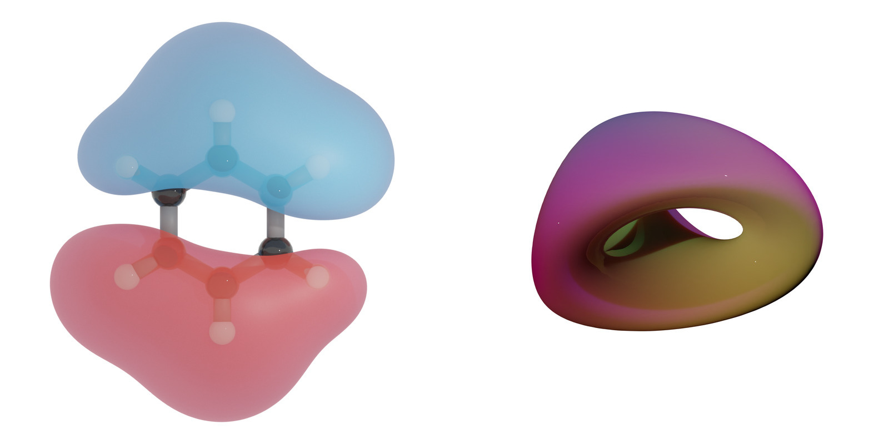

# Summary

The concept of electron density lies at the heart of electronic structure
calculations, offering a precise depiction of how electrons are distributed
within a material or molecule. Across various electronic structure
methodologies, electron density serves as the cornerstone, enabling derivation
of crucial properties like energy, potential, and forces. It unravels the
intricacies of chemical bonding and reactivity, playing a pivotal role in
anticipating and interpreting the characteristics of both materials and
molecules, particularly in discerning electron redistribution during bond
formation or rupture

The electron density is a scalar field, which means that it is a function that
assigns a scalar value to each point in space. In the case of the electron
density, this scalar value represents the probability density of finding an
electron at that point in space. Specialized visualization tools and techniques
are often required to effectively visualize scalar fields such as the electron
density. These tools may include contour plots, isosurface rendering, or volume
rendering, among others. Visualizing the electron density is essential for
gaining insights into the electronic properties and behavior of materials and
molecules.

`Den2Obj` is a C++-based command-line tool designed to construct isosurfaces of
an electron density scalar field. It can parse CHGCAR and PARCHG files of VASP
as well as Gaussian Cube files. `Den2Obj` also supports converting these into
native `.d2o` files which offer a significant compression with respect to these
former files. The resulting isosurfaces can be stored in Stereolitography
(`.stl`), Polygon File Format (`.ply`) and Wavefront (`.obj`) files. 

# Statement of need

Isosurfaces play a pivotal role in both scientific research and engineering
applications, offering a powerful tool for visualizing complex data sets and
understanding intricate phenomena. These surfaces represent points in a field
where a specific value, known as the isovalue, is constant. Due to its
importance, there exists many programs that readily support isosurface
generation, such as `Open Data Explorer` [@OpenDX], `Matlab` [@MATLAB], `ParaView`
[@ParaView], and `Vesta` [@momma:2011]. These tools are mainly designed for
interactive use and utilize a graphical user interface of some sort.

In contrast, `Den2Obj` is a C++-based command-line tool that performs isosurface
construction from `VASP` [@hafner:2008] `CHGCAR` or `PARCHG` and and Gaussian
[@gaussian] Cube files. The resulting isosurfaces can be stored as
Stereolitography (`.stl`), Polygon File Format (`.ply`) or Wavefront (`.obj`)
files. Furthermore, `Den2Obj` is able to convert isosurfaces to the OpenVDB
[@museth:2013] format allowing for volumetric rendering in programs such as
Blender or to convert these files to `d2o` which offers a significant reduction
in size as compared to the above-mentioned input files.

Isosurfaces can be constructed using the marching cubes [@lorensen:1987] or the
marching tetrahedra [@burke:1994] algorithms, which the user is free to decide. Both these
algorithms are implemented using OpenMP parallelization making optimal use of
modern multi-core CPUs. Upon conversion of input files to the native `d2o` file
type, the program explores various compression algorithms, i.e. `lzma`
[@lzmaweb], `bzip2` [@bzip2web] and `gzip` [@gzipweb], and uses the one that
yields optimal results. For demonstration and testing purposes, also a scalar
field generator functionality is included that can create a number of relevant
scalar fields to test the algorithms on. An example is provided in
\autoref{fig:isosurface_examples}.

`Den2Obj` requires a relatively small set of dependencies, being Eigen3
[@eigenweb], Boost [@BoostLibrary], `TCLAP` [@TclapLibrary], `lzma` [@lzmaweb],
`bzip2` [@bzip2web] and `gzip` [@gzipweb]. Creation of VDB files requires the
presence of the OpenVDB library [@museth:2013]. The user can select during
compilation whether they want to include this functionality or not. `Den2Obj`
is designed to be used by researchers and students working in computational
materials modelling using the quantum chemical software. It has already been
used in a number of scientific publications. [@filot:2016; @su:2016; @su:2018]

An extensive user guide including examples, compilation instructions and
documentation of the command-line arguments is available at
https://den2obj.imc-tue.nl/.

# Acknowledgements

This work was supported by the Netherlands Center for Multiscale Catalytic
Energy Conversion, and NWO Gravitation program funded by the Ministry of
Education, Culture and Science of the government of the Netherlands. The
Netherlands Organization for Scientific Research is acknowledged for
providing access to computational resources.

# References
