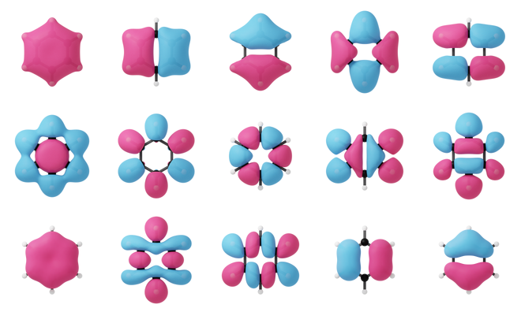
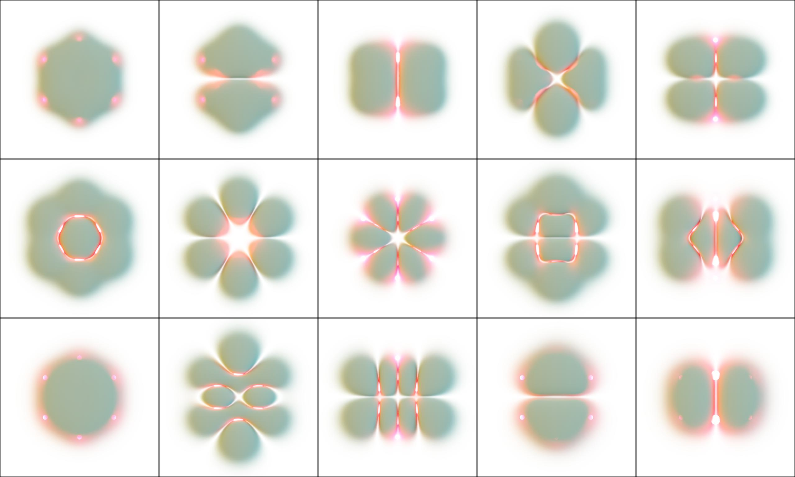

# Summary

Electron density plays a foundational role in electronic structure calculations.
It offers a detailed spatial representation of the distribution of electrons in
molecules and materials. In computational methodologies, most notably Density
Functional Theory (DFT), electron density serves as a central quantity from
which key properties such as total energy, electrostatic potential, and atomic
forces are derived. The analysis of electron density provides significant
insights into chemical bonding, reactivity, and electron redistribution,
especially during bond formation and dissociation. This capability enables the
prediction and interpretation of the properties of materials and molecular
systems.

Electron density is mathematically represented as a scalar field. It assigns a
scalar value, corresponding to the probability density of finding an electron,
to each point in three-dimensional space. Due to the complexity and high
dimensionality of such data, specialized visualization techniques are necessary
for meaningful interpretation. Common methods include contour plotting,
isosurface generation, and volumetric rendering. These techniques facilitate the
exploration of electronic behavior and structural characteristics.

This utility, `Den2Obj`, is a C++ based command line program developed to
generate isosurfaces from electron density scalar fields. It supports input
formats that are commonly used in electronic structure calculations, including
CHGCAR and PARCHG files produced by VASP, as well as Gaussian Cube files.
`Den2Obj` is capable of converting these formats into a native `.d2o` file
format, which achieves substantial reductions in file size through efficient
compression. The resulting isosurfaces can be exported in several widely
supported geometry file formats, including STL (Stereolithography), PLY (Polygon
File Format), and OBJ (Wavefront). These output formats enable convenient
integration with a broad range of visualization and post-processing software
tools.

# Statement of need

## Isosurface Visualization with `Den2Obj`

Isosurfaces play a central role in scientific research and engineering
applications by providing an effective means of visualizing complex scalar
fields and understanding intricate physical phenomena. An isosurface represents
a set of points in a field where a scalar quantity, known as the *isovalue*,
remains constant. Due to their importance, many software packages support
isosurface generation, including `Open Data Explorer` [@OpenDX], `MATLAB`
[@MATLAB], `ParaView` [@ParaView], and `VESTA` [@momma:2011]. These tools are
primarily designed for interactive use and typically rely on graphical user
interfaces.

In contrast, `Den2Obj` is a C++-based command line tool developed for automated
isosurface extraction from electron density and wavefunction data. It supports
input formats commonly produced by `VASP` [@hafner:2008], such as `CHGCAR` and
`PARCHG`, as well as Gaussian [@gaussian] Cube files. The resulting isosurfaces
can be exported in widely used 3D geometry formats, including Stereolithography
(`.stl`), Polygon File Format (`.ply`), and Wavefront (`.obj`).

Isosurface generation in `Den2Obj` is carried out using either the marching
cubes algorithm [@lorensen:1987] or the marching tetrahedra algorithm
[@burke:1994], both of which can be selected via command line arguments. These
algorithms are implemented with OpenMP parallelization to leverage the
performance of modern multi-core CPUs. When visualizing wavefunctions rather
than electron densities, it is often useful to generate separate isosurfaces for
positive and negative lobes. `Den2Obj` accommodates this by enabling dual
isosurface generation through a single command line argument.

An illustrative example is presented in \autoref{fig:canonical_mo}, which
displays the canonical molecular orbitals of the benzene molecule. These
orbitals were computed using the PyQInt program.[@PyQInt] Isosurfaces were
generated via the marching cubes algorithm as implemented in Den2Obj, producing
.ply files that were subsequently imported into Blender[@Blender], along with
the atomic coordinates of benzene, for rendering.

For efficient research data management purposes, `Den2Obj` is also able to
convert `CHGCAR` and `PARCHG` files to its own custom `d2o` format, which is a
lossless format that stores the scalar field as a collection of floats utilizing
compression. Upon conversion of input files to the native `d2o` file type, the
program explores various compression algorithms, i.e. `lzma` [@lzmaweb], `bzip2`
[@bzip2web] and `gzip` [@gzipweb], and uses the one that yields optimal results.
In comparison to the original `CHGCAR` or `PARCHG` files, `d2o` files are able
to achieve a compression ratio around 10%.

Besides building isosurfaces, `Den2Obj` can also produce OpenVDB [@museth:2013]
files allowing for volumetric rendering in programs such as Blender. In contrast
to the rendering of isosurfaces, the main advantage of volumetric rendering is
that internal details and density variations are more prominently shown,
providing a comprehensive and nuanced understanding of the scalar field. In a
way, volumetric rendering lies in between isosurfaces and contour plots in terms
of visualizing a scalar field. An example for the molecular orbitals of benzene
is provided in \autoref{fig:volumetric_rendering}. For demonstration and testing
purposes, also a scalar field generator functionality is included that can
create a number of relevant scalar fields to test the algorithms on.

`Den2Obj` requires a relatively small set of dependencies, being Eigen3
[@eigenweb], Boost [@BoostLibrary], `TCLAP` [@TclapLibrary], `lzma` [@lzmaweb],
`bzip2` [@bzip2web] and `gzip` [@gzipweb]. Creation of VDB files requires the
presence of the OpenVDB library [@museth:2013]. The user can select during
compilation whether they want to include this functionality or not. `Den2Obj`
is designed to be used by researchers and students working in computational
materials modelling using the quantum chemical software. It has already been
used in a number of scientific publications. [@filot:2016; @su:2016; @su:2018]

An extensive user guide including examples, compilation instructions, tutorials
(including a rendering tutorial in Blender) and documentation of the
command-line arguments, is available at https://den2obj.imc-tue.nl/.

# Acknowledgements

This work was supported by the Netherlands Center for Multiscale Catalytic
Energy Conversion, and NWO Gravitation program funded by the Ministry of
Education, Culture and Science of the government of the Netherlands. The
Netherlands Organization for Scientific Research is acknowledged for
providing access to computational resources.

# References
