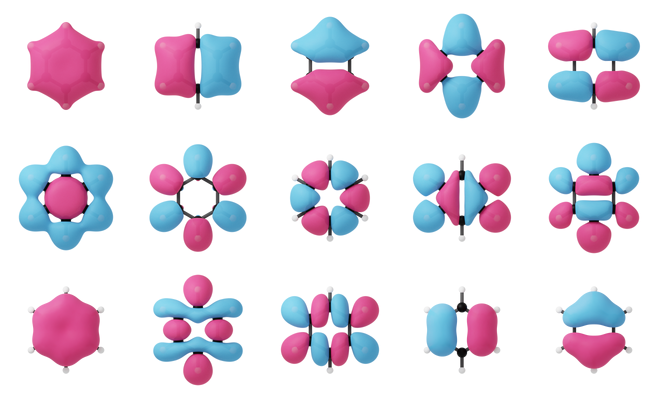
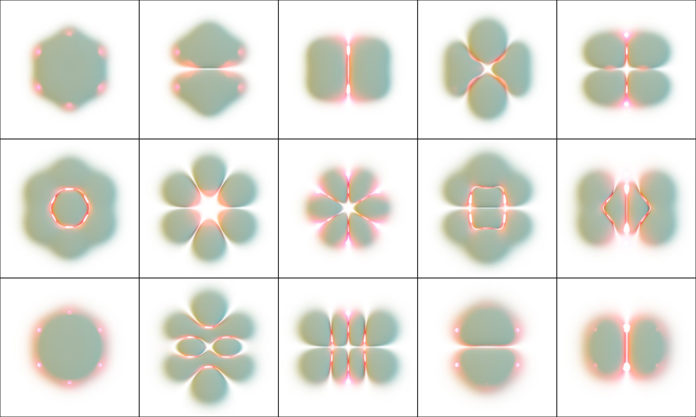

# Summary

Electron density is a foundational quantity in electronic structure
calculations. It describes the spatial distribution of electrons in molecules
and materials, and is used to derive key properties such as total energy,
electrostatic potential, and atomic forces. Because electron density is a
three-dimensional scalar field, specialized visualization techniques, including
contour plotting, isosurface generation, and volumetric rendering, are needed to
interpret bonding, reactivity, and electron redistribution.

`Den2Obj` is a C++ command-line program for generating isosurfaces from electron
density scalar fields. It supports input formats commonly used in electronic
structure calculations, including CHGCAR and PARCHG files produced by VASP, as
well as Gaussian Cube files. The resulting isosurfaces can be exported in widely
supported geometry file formats, including STL (Stereolithography), PLY (Polygon
File Format), and OBJ (Wavefront), enabling integration with visualization,
rendering, and post-processing tools. In addition, `Den2Obj` can convert scalar
fields to a documented native `.d2o` format, a lossless binary container that
stores the grid and unit-cell metadata while selecting an efficient compression
method automatically.

# Statement of need

Isosurfaces play a central role in scientific research and engineering
applications by providing an effective means of visualizing complex scalar
fields and understanding intricate physical phenomena. An isosurface represents
a set of points in a field where a scalar quantity, known as the *isovalue*,
remains constant. Many software packages support isosurface generation,
including `Open Data Explorer` [@OpenDX], `MATLAB` [@MATLAB], `ParaView`
[@ParaView], `VESTA` [@momma:2011], PyVista [@pyvista], and chemistry-oriented
tools built on such libraries, such as ChemVista [@ChemVista]. These packages
and libraries are valuable for interactive inspection, scripting, and
application-specific visualization workflows.

`Den2Obj` occupies a narrower niche: reproducible, non-interactive conversion of
electronic-structure grid data into mesh and volume assets that can be used in
automated analysis, documentation, and rendering pipelines. It directly reads
formats commonly produced by `VASP` [@hafner:2008], such as `CHGCAR` and
`PARCHG`, as well as Gaussian [@gaussian] Cube files. The resulting isosurfaces
can be exported in widely used 3D geometry formats, including Stereolithography
(`.stl`), Polygon File Format (`.ply`), and Wavefront (`.obj`).

Isosurface generation in `Den2Obj` is carried out using either the marching
cubes algorithm [@lorensen:1987] or the marching tetrahedra algorithm
[@burke:1994], both of which can be selected via command line arguments. These
algorithms are implemented with OpenMP parallelization to leverage the
performance of modern multi-core CPUs. When visualizing wavefunctions rather
than electron densities, it is often useful to generate separate isosurfaces for
positive and negative lobes. `Den2Obj` accommodates this by enabling dual
isosurface generation through a single command line argument.

An illustrative example is presented in \autoref{fig:canonical_mo}, which
displays the canonical molecular orbitals of the benzene molecule. These
orbitals were computed using the PyQInt program [@PyQInt]. Isosurfaces were
generated via the marching cubes algorithm as implemented in Den2Obj, producing
`.ply` files that were subsequently imported into Blender [@Blender], along with
the atomic coordinates of benzene, for rendering.

For efficient research data management purposes, `Den2Obj` is also able to
convert `CHGCAR` and `PARCHG` files to its own custom `.d2o` format. This format
is one of the distinctive components of the software: it provides a documented,
lossless binary representation of dense scalar fields, including unit-cell and
grid metadata, so that large electronic-structure outputs can be archived and
reloaded without reparsing text-based `CHGCAR` or `PARCHG` files. Upon
conversion, the program explores multiple compression algorithms, namely
`gzip`, `lzma`, `bzip2`, Zstandard (`zstd`) and Blosc, and uses the one that
yields optimal results. These options cover Lempel-Ziv and Huffman-style
compression [@ziv:1977; @huffman:1952], block-sorting compression based on the
Burrows-Wheeler transform [@fenwick:1996], the Zstandard format [@zstandard],
and cache-aware block compression for numerical data [@alted:2010]. Such size
reductions are expected when converting human-readable grid data to compressed
binary storage; nevertheless, `.d2o` provides a convenient archival and
intermediate representation, with files that can be as small as about 10% of the
original `CHGCAR` or `PARCHG` file size.

Another distinguishing feature is direct conversion of electronic-structure
scalar fields to OpenVDB [@museth:2013] files for volumetric rendering in
programs such as Blender. In contrast to the rendering of isosurfaces, the main
advantage of volumetric rendering is that internal details and density
variations are more prominently shown, providing a comprehensive and nuanced
understanding of the scalar field. In a way, volumetric rendering lies in
between isosurfaces and contour plots in terms of visualizing a scalar field. An
example for the molecular orbitals of benzene is provided in
\autoref{fig:volumetric_rendering}. For demonstration and testing purposes, also
a scalar field generator functionality is included that can create a number of
relevant scalar fields to test the algorithms on.

`Den2Obj` requires a relatively small set of dependencies: Eigen3
[@eigenweb], Boost [@BoostLibrary], `TCLAP` [@TclapLibrary], and compression
libraries for `gzip`, `lzma`, `bzip2`, Zstandard and Blosc. Creation of VDB
files requires the presence of the OpenVDB library
[@museth:2013]. The user can select during
compilation whether they want to include this functionality or not. `Den2Obj`
is designed to be used by researchers and students working in computational
materials modelling and quantum chemistry. It has already been used in a number
of scientific publications. [@filot:2016; @su:2016; @su:2018]

An extensive user guide including examples, compilation instructions, tutorials
(including a rendering tutorial in Blender) and documentation of the
command-line arguments, is available at https://den2obj.imc-tue.nl/.

# Acknowledgements

This work was supported by the Netherlands Center for Multiscale Catalytic
Energy Conversion, and NWO Gravitation program funded by the Ministry of
Education, Culture and Science of the government of the Netherlands. The
Netherlands Organization for Scientific Research is acknowledged for
providing access to computational resources.

# References
